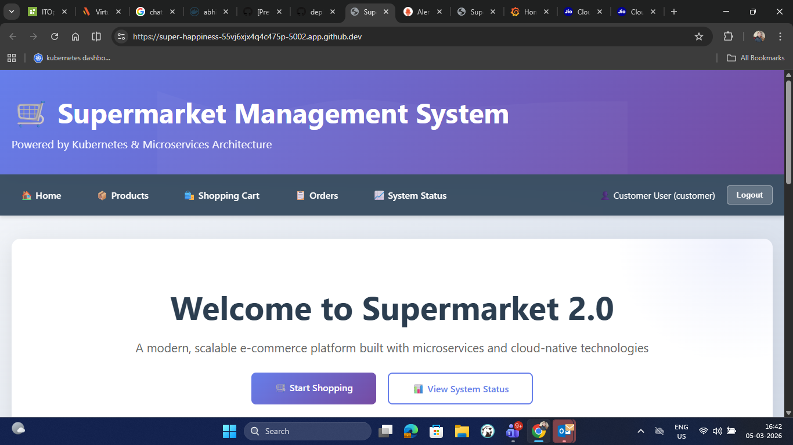
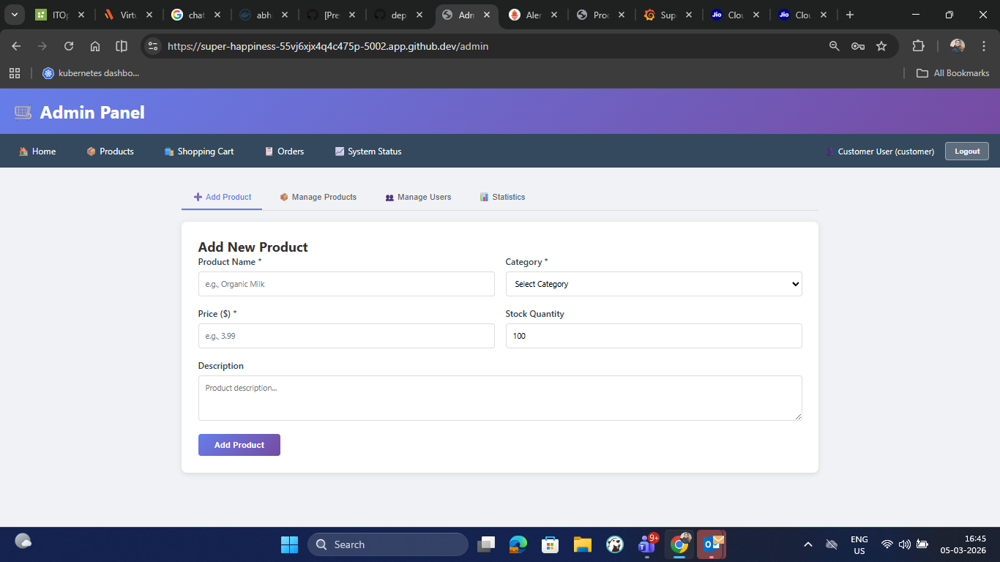
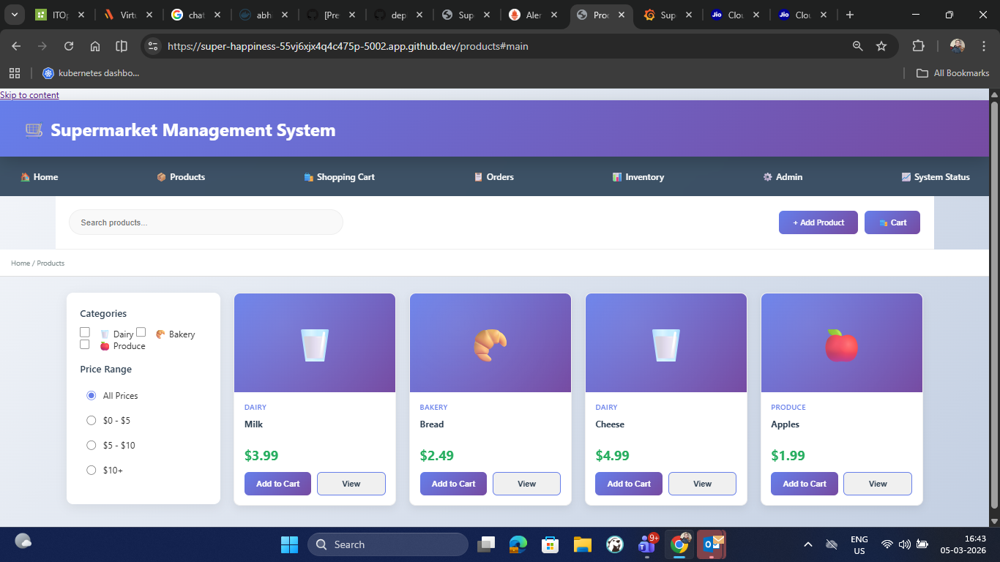
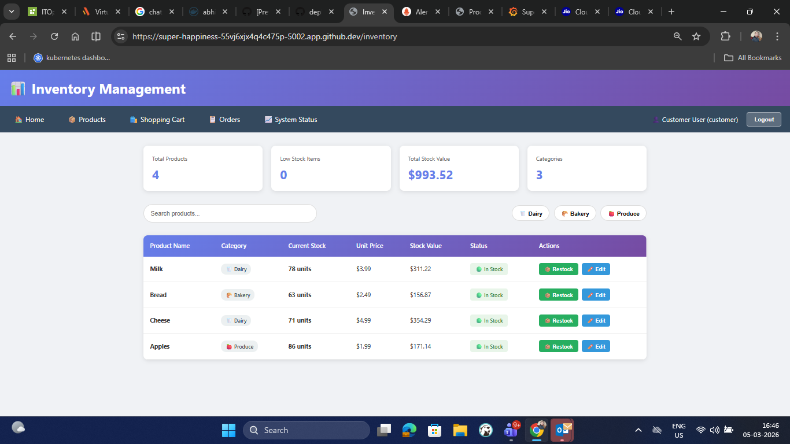
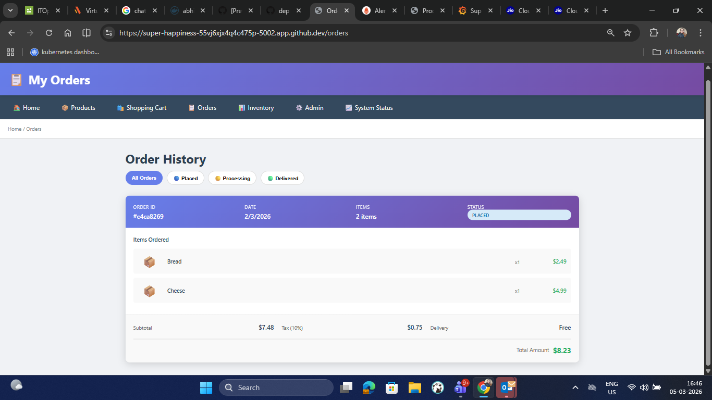
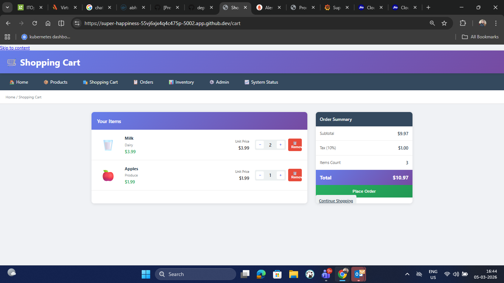
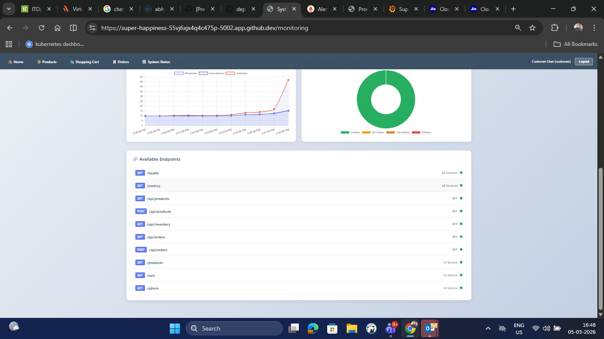
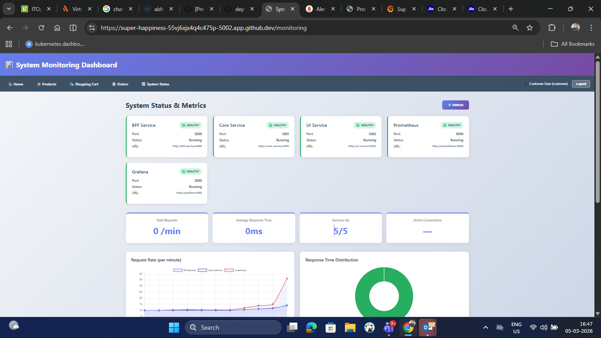
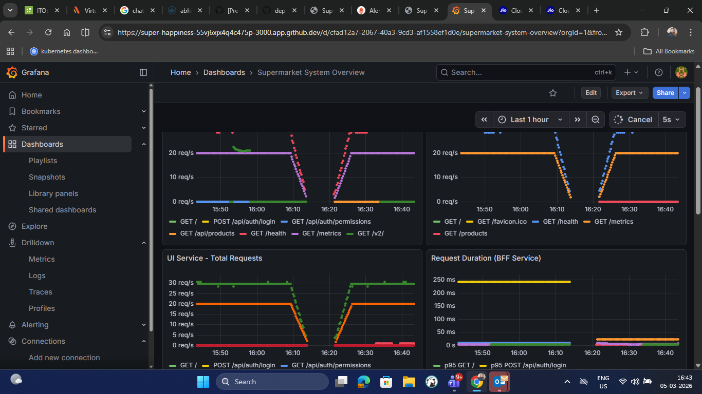
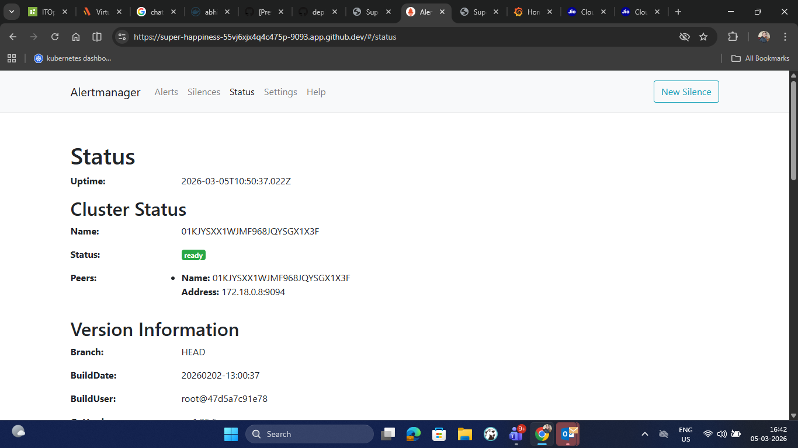

# Prometheus_Grafana-Learning

Learning **Prometheus**, **Grafana-stack**, and **Monitoring** through a production-ready **Supermarket Microservices Application**.

---

## 🎯 Overview

A full-featured supermarket management system built with microservices architecture, Kubernetes orchestration, and comprehensive monitoring using Prometheus and Grafana.

### Key Features
- ✅ **5 Microservices**: Auth, BFF, Core, Customer Management, UI
- ✅ **Full RBAC System**: Role-based access control with JWT
- ✅ **Prometheus Monitoring**: Metrics collection with 15s scrape interval
- ✅ **Grafana Dashboards**: Pre-built visualizations
- ✅ **Kubernetes Ready**: Manifests for Minikube, Kind, EKS, GKE, AKS
- ✅ **Terraform IaC**: Infrastructure as Code deployment
- ✅ **GitOps with ArgoCD**: optional, can auto-install via `deploy.sh` or Terraform (`enable_argocd`)
- ✅ **Docker Compose**: Local development stack
- ✅ **Professional UI**: Modern, responsive design with real-time monitoring dashboard

---

## 🏗️ Architecture

```
┌─────────────────────────────────────────────────────────────┐
│                    UI Service (5002)                         │
│              Frontend Web Application                         │
└──────────────────┬──────────────────────────────────────────┘
                   │
┌──────────────────▼──────────────────────────────────────────┐
│                 BFF Service (5000)                           │
│         Backend for Frontend - API Gateway                   │
└───────┬───────────────┬──────────────────┬──────────────────┘
        │               │                  │
┌───────▼───────┐ ┌─────▼─────┐ ┌──────────▼──────────┐
│ Auth Service  │ │   Core    │ │ Customer Management │
│    (5003)     │ │  (5001)   │ │       (5004)        │
└───────────────┘ └───────────┘ └─────────────────────┘

Monitoring Stack:
┌──────────────────────────────────────────────────────────┐
│  Prometheus (9090)  ←──────  All Services /metrics       │
│        ↓                                                 │
│  Grafana (3000)  ─────────  Dashboards & Visualization   │
└──────────────────────────────────────────────────────────┘
```

---

## 🚀 Quick Start

### Option 1: Local Docker Compose (2 Minutes)

```bash
cd supermarket-app
chmod +x run-local.sh
./run-local.sh
```

**Access Services:**
| Service | URL | Credentials |
|---------|-----|-------------|
| Web UI | http://localhost:5002 | - |
| BFF API | http://localhost:5000 | - |
| Core API | http://localhost:5001 | - |
| Prometheus | http://localhost:9090 | - |
| Grafana | http://localhost:3000 | admin / admin |

### Option 2: Windows PowerShell (Local Python)

> ⚙️ **GitOps tip**: set `ARGOCD_ENABLED=true` in your environment before running any deployment option (1‑4) and the script will install ArgoCD and the application automatically. You can also enable the same behaviour in Terraform by passing `-var='enable_argocd=true'`.


```powershell
cd supermarket-app
.\start_app.ps1
```

### Option 3: Kubernetes (5-10 Minutes)

```bash
cd supermarket-app
chmod +x build-images.sh deploy-k8s.sh
./build-images.sh
./deploy-k8s.sh
```

**Port Forwarding:**
```bash
kubectl port-forward -n supermarket svc/ui-service 5002:5002
kubectl port-forward -n monitoring svc/grafana 3000:3000
kubectl port-forward -n monitoring svc/prometheus 9090:9090
```

### Option 4: Terraform

```bash
cd supermarket-app/terraform
terraform init
terraform plan
terraform apply
```

---

## 📸 Screenshots

A set of application and monitoring screenshots illustrating the live project. These images are stored under `supermarket-app/screenshot` and are already populated with real captures. If you wish to update them, replace the corresponding `.png` file with your own screenshot (keeping the filename intact) and the previews below will update automatically.





















---

---

## 📂 Project Structure

```
supermarket-app/
├── services/
│   ├── auth-service/        # JWT Authentication & RBAC (5003)
│   ├── bff/                 # API Gateway (5000)
│   ├── core-service/        # Products, Orders, Inventory (5001)
│   ├── customer-mgmt/       # Customer Profiles & Loyalty (5004)
│   └── ui-service/          # Frontend Web App (5002)
├── k8s/
│   ├── services/            # K8s Deployments & Services
│   ├── monitoring/          # Prometheus & Grafana
│   └── dashboard/           # Kubernetes Dashboard
├── terraform/               # Infrastructure as Code
├── grafana/                 # Dashboards & Datasources
├── docker-compose.yml       # Local development
├── build-images.sh          # Build Docker images
├── deploy-k8s.sh            # Deploy to Kubernetes
├── run-local.sh / start_app.ps1  # Start local stack
└── stop-local.sh            # Stop local stack
```

---

## 🔐 Authentication & RBAC

### Default Users
| Role | Email | Password |
|------|-------|----------|
| Admin | admin@supermarket.com | admin123 |
| Customer | customer@supermarket.com | customer123 |

### Roles
- **Admin**: Full access to all tabs, user management, product upload
- **Customer**: Products, Cart, Orders, Profile only

### Kubernetes RBAC
Within the Kubernetes deployment, all application pods run using a dedicated
`ServiceAccount` named `supermarket-app-sa`.  Namespace‑scoped `Role`/`RoleBinding`
resources grant the account read‑only access (`get`,`list`,`watch`) to core
objects (pods, services, configmaps, deployments) so that the app can
interact safely with the cluster without requiring a cluster‑admin token.
See `k8s/base/rbac.yaml` for details.

---

## 📊 API Reference

### BFF Service (http://localhost:5000)
```
GET  /health              - Health check
GET  /metrics             - Prometheus metrics
GET  /api/products        - List all products
GET  /api/products/{id}   - Get product details
POST /api/orders          - Create new order
GET  /api/orders/{id}     - Get order details
```

### Core Service (http://localhost:5001)
```
GET  /health              - Health check
GET  /metrics             - Prometheus metrics
GET  /products            - List all products
POST /products            - Create product
POST /orders              - Create order
PUT  /orders/{id}/status  - Update order status
```

### Example API Calls
```bash
# Get products
curl http://localhost:5000/api/products

# Create order
curl -X POST http://localhost:5000/api/orders \
  -H "Content-Type: application/json" \
  -d '{"items": [{"id": "1", "name": "Milk", "price": 3.99, "quantity": 2}]}'
```

---

## 📈 Monitoring & Observability

### Prometheus Metrics
```promql
# Request rate
rate(bff_requests_total[5m])

# Average latency
avg(bff_request_duration_seconds) * 1000

# Orders per minute
sum(rate(orders_created_total[1m])) * 60

# Error rate
rate(bff_requests_total{status=~"5.."}[5m])

# 95th percentile latency
histogram_quantile(0.95, rate(bff_request_duration_seconds_bucket[5m]))
```

### Grafana Dashboards
1. Login at http://localhost:3000 (admin/admin)
2. Go to Dashboards → Browse
3. Select "Supermarket System Overview"

### Custom Dashboard
1. Click **+** → **Dashboard**
2. **Add Panel** → Select Prometheus datasource
3. Write PromQL query → **Save**

---

## ☸️ Kubernetes Dashboard

### Get Admin Token
```bash
kubectl -n kubernetes-dashboard create token admin-user
```

### Access Dashboard
```bash
kubectl -n kubernetes-dashboard port-forward svc/kubernetes-dashboard 8443:443
# Open: https://localhost:8443
```

---

## 🛠️ Troubleshooting

### Docker Compose
```bash
docker-compose logs -f service-name
docker-compose ps
docker-compose restart
```

### Kubernetes
```bash
kubectl get pods -n supermarket
kubectl describe pod <pod-name> -n supermarket
kubectl logs <pod-name> -n supermarket
kubectl get events -n supermarket
```

### Prometheus Not Collecting
```bash
# Check targets
http://localhost:9090/targets

# Verify metrics endpoint
curl http://localhost:5000/metrics
```

---

## 🌐 UI Pages

| Page | URL | Description |
|------|-----|-------------|
| Home | `/` | Welcome page with features |
| Products | `/products` | Browse & filter products |
| Cart | `/cart` | Shopping cart |
| Orders | `/orders` | Order history |
| Inventory | `/inventory` | Stock management |
| Admin | `/admin` | Product upload, statistics |
| **Monitoring** ⭐ | `/monitoring` | Real-time system dashboard |

---

## 🚢 Production Deployment

### Cloud Platforms Supported
- **AWS EKS**
- **Google GKE**
- **Azure AKS**
- **Minikube/Kind** (Local)

### Production Checklist
1. Push images to private registry
2. Use Kubernetes Secrets for sensitive data
3. Add PVC for Prometheus and Grafana
4. Configure AlertManager
5. Enable TLS/HTTPS
6. Set up Ingress controller
7. Configure HPA (Horizontal Pod Autoscaler)
8. Implement network policies

---

## 📚 Resources

- [Prometheus Documentation](https://prometheus.io/docs/)
- [Grafana Documentation](https://grafana.com/docs/)
- [Kubernetes Documentation](https://kubernetes.io/docs/)
- [Flask Documentation](https://flask.palletsprojects.com/)

---

## ✅ Project Status

**All components fully implemented and documented:**
- ✅ 5 Microservices (Auth, BFF, Core, Customer Mgmt, UI)
- ✅ Prometheus monitoring stack
- ✅ Grafana dashboards
- ✅ Kubernetes Dashboard integration
- ✅ Docker Compose for local development
- ✅ Kubernetes manifests for production
- ✅ Terraform Infrastructure as Code
- ✅ Complete API documentation
- ✅ Health checks and probes
- ✅ RBAC and security

**Ready for immediate use in development, learning, and production environments!**

---

## 📄 License

This project is provided as-is for learning and development purposes.
